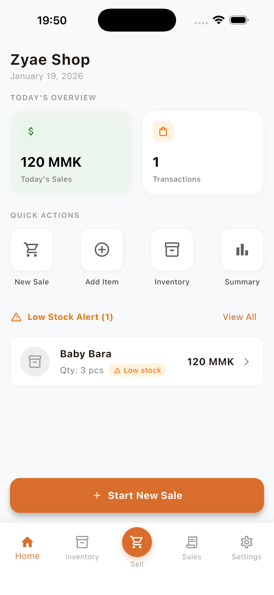
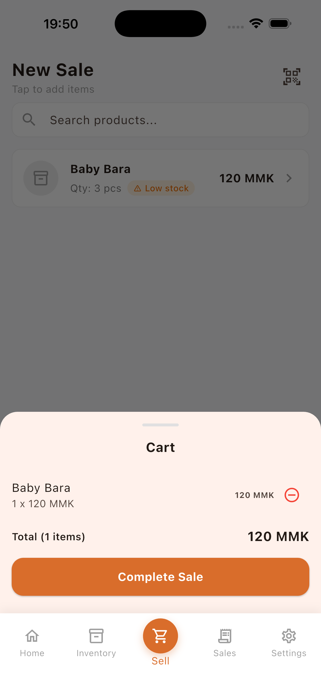
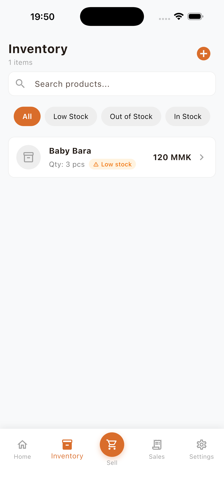
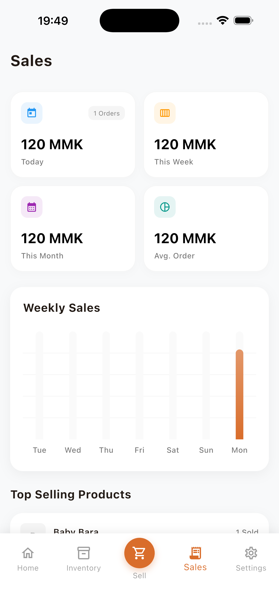
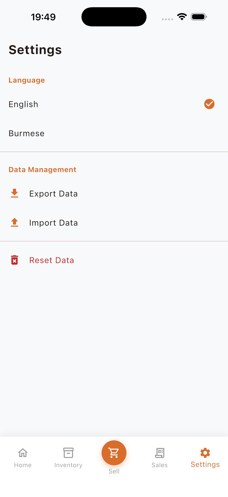

# Zyae - Modern POS & Inventory Management

**Zyae** is a powerful, offline-first Point of Sale (POS) and Inventory Management application built with Flutter. Designed for efficiency and ease of use, it helps small to medium-sized businesses manage sales, track inventory, and analyze performance with a modern, intuitive interface.

> Tailored for the Myanmar market with native MMK currency support and bilingual (English/Burmese) capabilities.

---

## 📸 Screenshots

| **Dashboard** | **Point of Sale** |
|:---:|:---:|
|  |  |
| *Quick overview of daily metrics* | *Fast checkout with barcode scanning* |

| **Inventory** | **Sales Analysis** |
|:---:|:---:|
|  |  |
| *Manage products and stock levels* | *Visual insights and transaction history* |

<div align="center">
  <h3>Settings & Localization</h3>
  
  <p><i>Data management and language preferences</i></p>
</div>

---

## ✨ Key Features

- **🚀 Smart Dashboard**: Get instant visibility into today's sales, transaction counts, and key performance metrics.
- **🛒 Efficient POS**: Streamlined checkout process with:
  - Barcode scanning support
  - Product search
  - Cart management
  - Receipt generation
- **📦 Inventory Control**: Complete product management system:
  - Add, edit, and delete products
  - Track stock quantities
  - Manage suppliers
- **📊 Analytics & Reports**: 
  - Visual charts for weekly sales trends
  - Top-selling products analysis
  - Detailed transaction history
- **🌍 Localization**: Fully localized for **English** and **Burmese (Myanmar)** languages.
- **💾 Offline-First**: Built on **Hive**, ensuring all data is stored locally and accessible without an internet connection.

---

## 🛠 Tech Stack

- **Framework**: [Flutter](https://flutter.dev/)
- **State Management**: [Flutter Bloc (Cubits)](https://pub.dev/packages/flutter_bloc)
- **Local Database**: [Hive](https://pub.dev/packages/hive)
- **Navigation**: [GoRouter](https://pub.dev/packages/go_router)
- **Charts**: [fl_chart](https://pub.dev/packages/fl_chart)
- **Scanning**: [mobile_scanner](https://pub.dev/packages/mobile_scanner)
- **Localization**: `flutter_localizations`

---

## 🚀 Getting Started

1. **Clone the repository**
   ```bash
   git clone https://github.com/yourusername/zyae.git
   cd zyae
   ```

2. **Install dependencies**
   ```bash
   flutter pub get
   ```

3. **Generate code (for Hive adapters & Localization)**
   ```bash
   dart run build_runner build --delete-conflicting-outputs
   flutter gen-l10n
   ```

4. **Run the app**
   ```bash
   flutter run
   ```

---

## 📱 Requirements

- Flutter SDK: `^3.10.7`
- Dart SDK: `^3.0.0`
